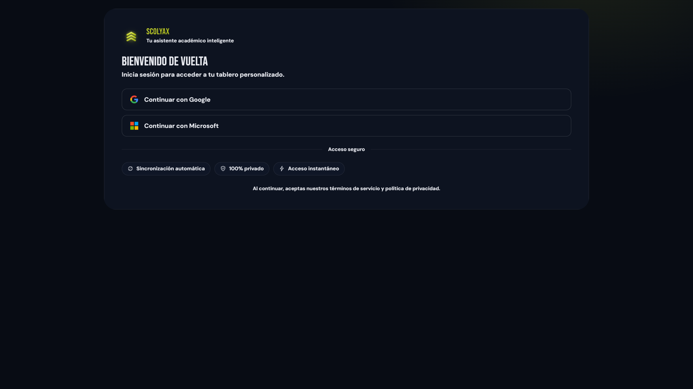
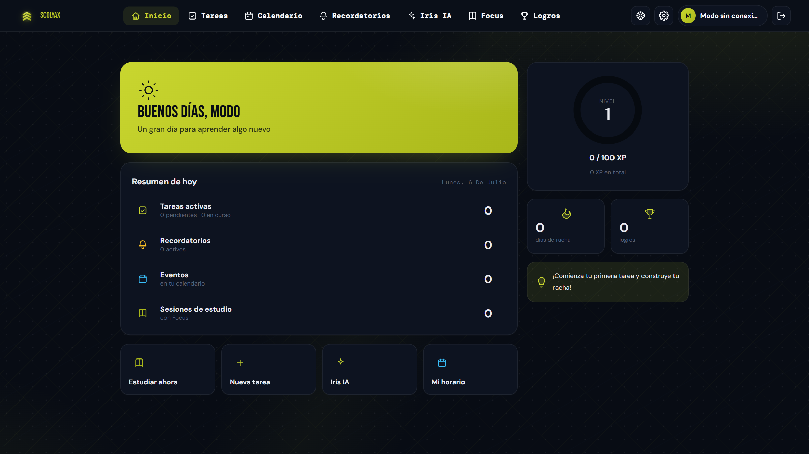
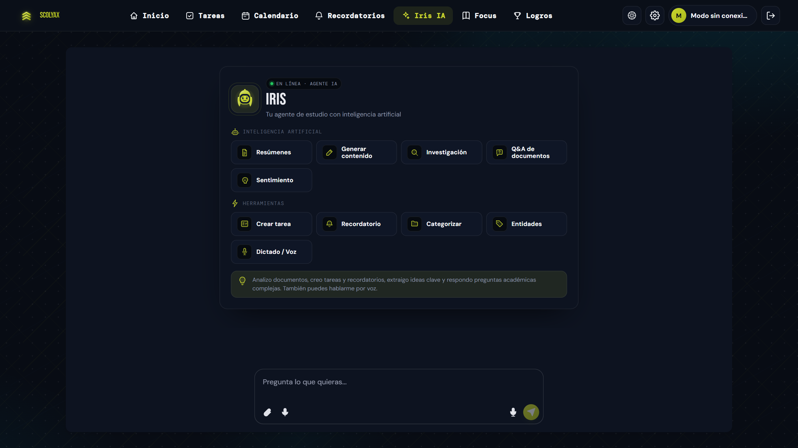

<div align="center">

# Scolyax

**Tu sistema operativo para estudiar con foco.**

Plataforma de productividad académica potenciada con IA, diseñada para estudiantes
que buscan rendir más — con especial atención a mentes neurodivergentes (TDAH).

</div>

---

## 📸 Vistazo rápido

| Inicio de sesión | Dashboard |
|---|---|
|  |  |

| Iris IA — tu agente de estudio |
|---|
|  |

## ✨ Características

- **Iris IA** — Agente de estudio con inteligencia artificial (Gemini):
  resúmenes de PDF/DOCX, generación de contenido, investigación, Q&A de
  documentos, análisis de sentimiento y comandos por voz. Crea tareas y
  recordatorios por ti mediante *function-calling*.
- **Focus** — 3 técnicas de estudio científicas (Pomodoro, Flowtime y 52/17)
  con monitoreo anti-distracciones vía extensión de Chrome (bloquea Netflix,
  YouTube, redes sociales…) y checkpoints de progreso verificados con IA.
- **Test cognitivo VARK** — Perfil de aprendizaje personalizado que genera un
  plan de estudio semanal y recomienda las herramientas ideales para ti.
- **Gestión académica** — Tareas en tablero kanban con estimación de tiempo
  por IA, recordatorios con notificaciones push y por correo, horario semanal
  y calendario multi-vista con integración de Google Calendar.
- **Gamificación** — XP, niveles, logros, rachas y retos diarios para
  mantener la motivación.
- **Modo Crisis** — Respiración guiada 4-7-8 y descomposición de tareas en
  micro-pasos para cuando todo se siente demasiado.
- **PWA instalable** — Funciona como app nativa en escritorio y móvil, con
  soporte offline.

## 🛠️ Stack

| Capa | Tecnología |
|---|---|
| Frontend | React 18 + Vite · PWA (service worker + IndexedDB) |
| Backend | FastAPI (Python) · OAuth con Google y Microsoft |
| IA | Google Gemini (agente con *function-calling*) |
| Extensión | Chrome Extension (Manifest V3) para el anti-distracción de Focus |
| Despliegue | Vercel (frontend) · Railway (backend) |

## 📁 Estructura

```
frontend/          React + Vite (PWA)
  src/components/  Paneles: tareas, Focus, calendario, Iris, logros, crisis…
  public/scolyax-extension/  Extensión Chrome anti-distracciones
backend/
  app/             API FastAPI: auth OAuth, tareas, recordatorios, IA, admin
screenshots/       Capturas del producto
```

## ⚖️ Licencia

Este proyecto se publica **solo como exhibición** (portafolio).
**Todos los derechos reservados** — no está permitido usar, copiar, modificar
ni redistribuir el código, los diseños o la marca sin autorización escrita.
Consulta el archivo [LICENSE](LICENSE).

---

<div align="center">
Hecho con ❤ para estudiantes · <b>Scolyax</b> · contacto: appscolyax@gmail.com
</div>
